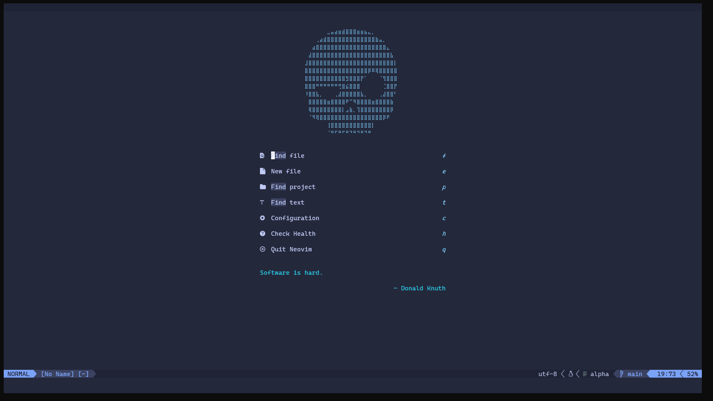
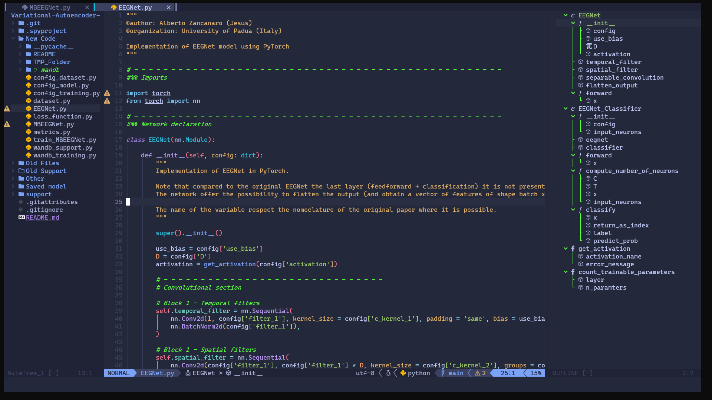
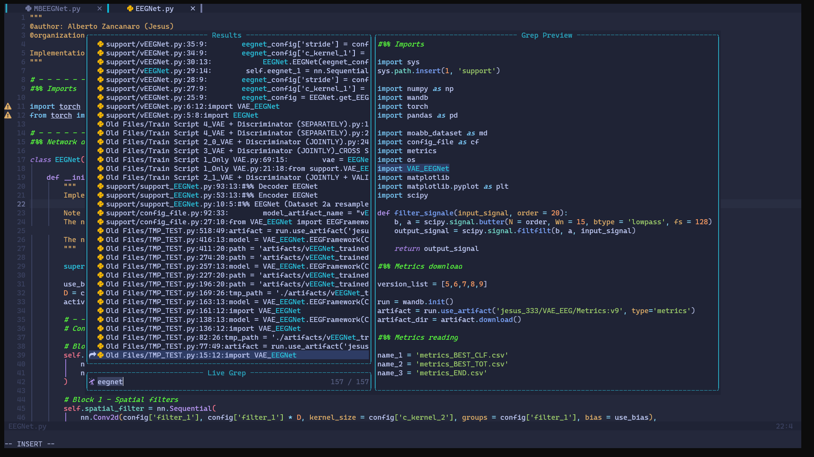
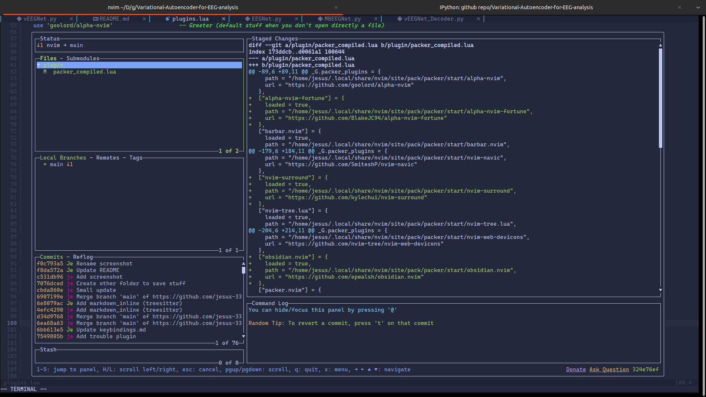

# neovim-config
Pure lua configuration for Neovim editor

Based on [Neovim-from-scratch](https://github.com/LunarVim/Neovim-from-scratch) from [LunarVim](https://github.com/LunarVim).

 |  
:-------------------------:|:-------------------------:
 |   

The list of features include:
- LSP Integration (through [Mason](mason-lspconfig))
- The classic cool stuff (treesitter, telescope, nvim-tree)
- Alpha greeter for a cool starting screen
- [Lazygit integration](lazygit)
- [Shell integration](toggleterm)
- [Surround](surround) plugin (with custom keybindings)
- [Project integration]()

# Keybindings
A file containig the major part of keybindings can be find [here](other/keybindings.md)

# Fix for bugs
## Treesitter parser error
If treesitter raise the error `query error: invalid node type at position` use the command `:echo nvim_get_runtime_file('parser', v:true)` in neovim console. If more that one path appear remove/rename all the folder not related with treesitter.

## Latest neovim version
If you do not want to build neovim you can download the latest version through this commands:
```
sudo apt-get install software-properties-common
sudo add-apt-repository ppa:neovim-ppa/unstable
sudo apt-get update
sudo apt-get install neovim
```
[telescope-file-browser]:https://github.com/nvim-telescope/telescope-file-browser.nvim
[comments_plugin]:https://github.com/numToStr/Comment.nvim
[mason_LSP]:https://github.com/williamboman/mason-lspconfig.nvim
[surround]:https://github.com/kylechui/nvim-surround
[lazygit]:https://github.com/kdheepak/lazygit.nvim
[toggleterm]:https://github.com/akinsho/toggleterm.nvim
[project]:https://github.com/ahmedkhalf/project.nvim
